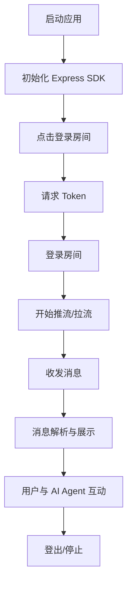

# AI Agent Quick Start (Android)

## 项目概述

本项目是基于 ZEGO Express Engine 的 Android 快速入门示例，演示了如何集成 AI Agent 语音聊天能力。用户可通过本应用体验与 AI Agent 的实时语音交互，消息自动滚动显示，支持房间登录、消息收发、流管理等功能。


⚠️ 在运行客户端前，请先启动[您的业务后台](https://github.com/ZEGOCLOUD/ai_agent_quick_start_server/tree/main)，分支需和客户端匹配

---

## 文件目录结构

```
app/src/main/java/im/zego/aiagent/express/quickstart/
├── MainActivity.java           # 主界面与核心业务逻辑
├── AIChatListView.java         # 聊天消息列表自定义控件
├── ZegoQuickStartApi.java      # 网络请求与后端接口封装
├── AudioChatMessageParser.java # 音频消息解析器（如有）
```

---

## 主要流程图



---

## 组件介绍

### 1. MainActivity

- 负责应用主流程，包括 SDK 初始化、房间登录、Token 获取、流管理、UI 状态切换等。
- 通过 `initExpressSDK()` 初始化 ZEGO 引擎。
- 通过 `requestZegoToken()` 获取 Token 并登录房间。
- 通过 `start()` 和 `stop()` 控制 AI Agent 会话的开始与结束。
- 通过 `initChatText()` 监听消息事件并更新聊天列表。

### 2. AIChatListView

- 自定义 ListView 控件，用于展示聊天消息。
- 内部包含 `ZegoVoiceCallMessageAdapter`，负责消息数据的适配与 UI 渲染。
- 支持自动滚动到底部、消息分己方/对方样式区分。

### 3. ZegoQuickStartApi

- 封装与后端服务的 HTTP 请求，包括获取 Token、启动/停止 AI Agent 会话等。
- 使用 OkHttp 进行异步网络通信。

### 4. AudioChatMessageParser

- 负责解析收到的音频/文本消息，将其转换为可展示的数据结构。
- 通过回调接口将解析后的消息列表传递给 UI 层。

---

## 快速开始
1. 参考[ai_agent_quick_start_server](https://github.com/ZEGOCLOUD/ai_agent_quick_start_server) 部署 quick_start 的业务后台
2. 克隆本仓库并导入 Android Studio。
3. 在 VoiceChatActivity.java 中配置您的 appId
4. 运行应用，点击“LoginRoom”申请语音权限，同意后体验 AI Agent 语音聊天。

---

## 注意事项

- 使用前请确保已注册 ZEGO 开发者账号并创建应用
- 运行时需要麦克风权限，请确保授予
- 确保设备有稳定的网络连接
- 本示例使用了 ZEGO Express SDK，请确保了解其基本用法


## 联系与支持

如有任何问题，请联系 ZEGO 技术支持或访问[开发者中心](https://docs.zegocloud.com/)获取更多信息。

