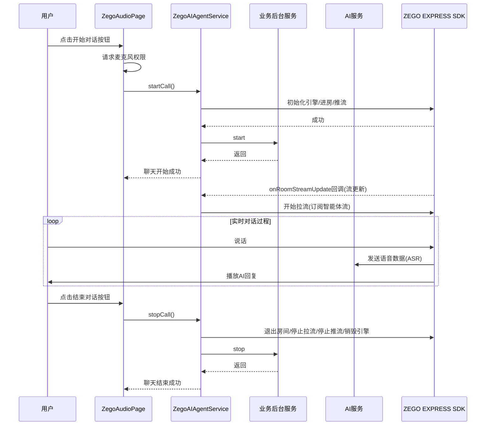

# AI Agent Quick Start Flutter

## 项目概述

这是一个基于 Flutter 开发的 AI 语音智能助手（Agent）Quick Start 项目，允许用户通过语音与 AI 智能体进行交互。项目实现了语音识别(ASR)、自然语言处理(LLM)和语音合成(TTS)的完整流程，支持实时语音对话和字幕显示。

## 技术栈

- 开发语言：Dart
- 框架：Flutter
- 平台：iOS、Android、Web
- 依赖库：ZegoExpressEngine（实时音视频）
- 服务：ZEGO AI Agent 服务

## 项目结构

```
lib/
├── main.dart                 # 应用程序入口
├── audio/                    # 音频相关模块
│   ├── subtitles/           # 字幕相关组件
│   │   ├── protocol/        # 字幕相关协议
│   │   │   └── message_dispatcher.dart  # 字幕消息分发器
│   │   └── views/           # 字幕UI组件
├── server/                   # 后台服务接口
│   ├── ai_agent_service.dart # ZEGO AI服务封装
│   ├── http_utils.dart      # HTTP工具类
│   ├── token_response.dart   # Token响应模型
│   └── zego_key.dart        # 密钥管理
└── widgets/                  # UI组件
    └── audio_chat_page.dart # 音频对话主界面
```

## 流程说明

### 应用启动流程

1. 应用启动，初始化 Flutter 应用
2. 加载 AudioChatPage 作为主界面，进入音频对话界面

### 音频对话流程



## 主要组件说明

### 1. ZegoAIAgentService

提供与 ZEGO AI 服务交互的接口，包括初始化、创建智能体实例、开始聊天和结束聊天。负责管理 Token 获取和缓存、房间管理、音视频流控制等功能。

### 2. ZegoAudioPage

音频对话主界面，负责处理用户交互、权限请求和音频流程管理。应用启动后直接进入本界面。

### 3. ZegoSubtitlesMessageDispatcher

字幕显示组件，实现对话内容的实时显示，包括用户输入和 AI 回复。负责处理来自 ZEGO Express SDK 的实验性 API 消息。

## 使用说明

1. 克隆项目到本地
2. 使用 IDE（如 VS Code 或 Android Studio）打开项目
3. 配置 AppID 和密钥
   - 前往 [ZEGO 控制台](https://console.zegocloud.com/) 创建项目
   - 获取 **AppID**，**AppSign** 和 **AppSecret**
   - 复制 `lib/server/zego_key.template` 文件并重命名为 `zego_key.dart`
   - 使用自己的密钥信息填充该文件
4. 运行项目
   ```bash
   flutter pub get
   flutter run
   ```
5. 启动后直接进入主界面体验

## 注意事项

- 使用前需要在 iOS 和 Android 平台配置相应的麦克风权限
- 需要有效的 ZEGO 账号和 AppID 以使用 AI 服务
- 网络环境会影响语音交互的流畅度
- 确保已安装 Flutter SDK 并配置好开发环境
- Web 平台注意事项：
  - 在 `web/index.html` 中需要引入以下 SDK 文件：
    ```html
    <script type="application/javascript" src="assets/packages/zego_express_engine/assets/ZegoExpressWebFlutterWrapper.js"></script>
    <script type="application/javascript" src="assets/packages/zego_zim/assets/index.js"></script>
    ```
  - 确保 Web 平台有麦克风访问权限
