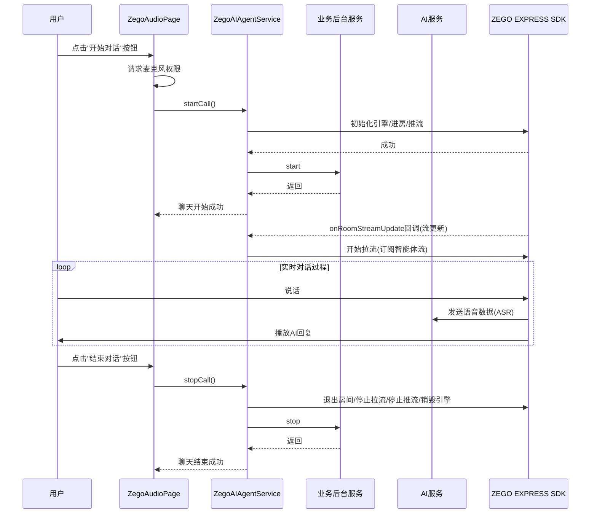
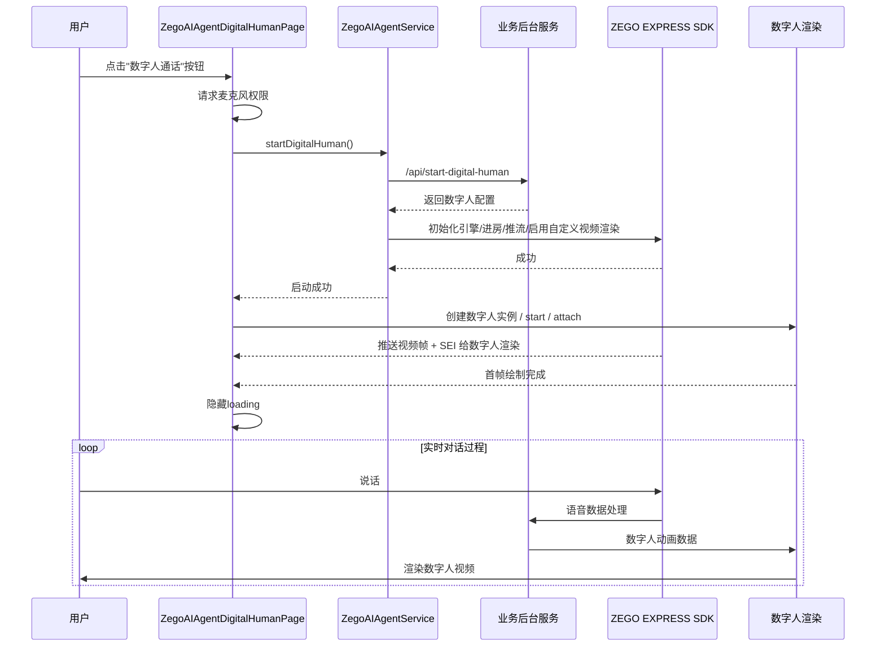
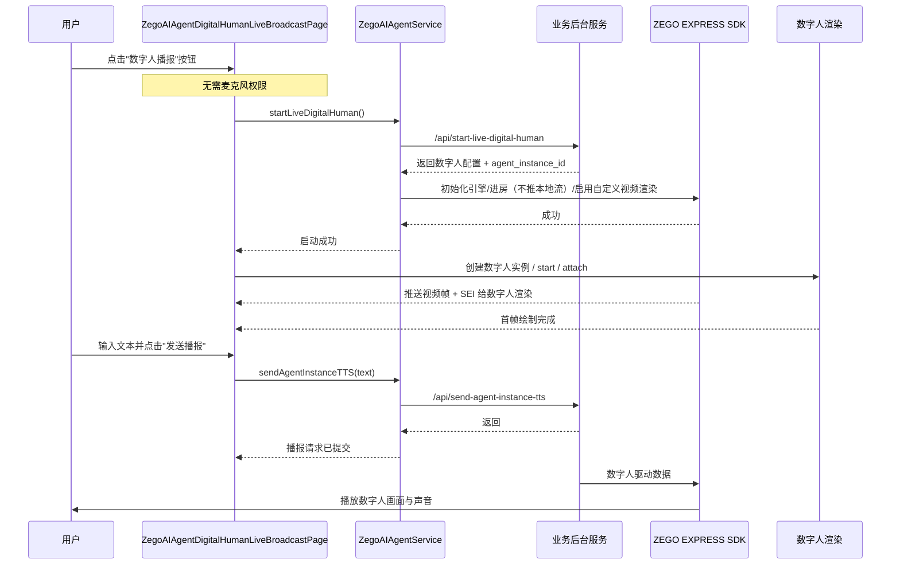

# AI Agent Quick Start Flutter

## 项目概述

这是一个基于 Flutter 开发的 AI 智能体（Agent）Quick Start 项目，通过 ZEGO Express SDK 与 AI Agent 服务对接，允许用户通过语音或视频与 AI 智能体进行交互，并支持服务端主动下发 TTS 让数字人播报任意文本。项目实现了语音识别(ASR)、自然语言处理(LLM)、语音合成(TTS) 的完整流程，支持实时语音对话、字幕显示，以及数字人视频通话与单向播报。

⚠️ 在运行客户端前，请先启动[您的业务后台](https://github.com/ZEGOCLOUD/ai_agent_quick_start_server/tree/main)，分支需和客户端匹配

## 示例能力

首页 `ZegoAIAgentHomePage` 提供三个入口：

- **Start Audio Call**：与 AI 进行纯语音对话
- **Start Digital Human Call**：与数字人进行视频对话（双向音视频）
- **Start Digital Human Broadcast**：服务端主动下发 TTS 让数字人朗读（单向观看）

## 技术栈

- 开发语言：Dart
- 框架：Flutter
- 平台：iOS、Android、Web
- 依赖库：ZegoExpressEngine（实时音视频）、zego_express_engine（Flutter 插件）、permission_handler（权限）
- 服务：ZEGO AI Agent 服务

## 项目结构

```
lib/
├── main.dart                 # 应用程序入口（注册麦克风权限 + 加载首页）
├── home_page.dart            # 首页入口控制器（语音通话 / 数字人 / 播报数字人）
├── local_strings.dart        # 多语言文案（占位字符串集中管理）
├── audio/                    # 音频相关模块
│   ├── page.dart             # 音频对话主界面 ZegoAudioPage
│   └── subtitles/            # 字幕相关组件
│       ├── protocol/         # 字幕协议层
│       │   ├── message_command.dart         # 字幕消息命令定义
│       │   ├── message_dispatcher.dart      # 字幕消息分发器（单例）
│       │   ├── message_model.dart           # 字幕消息数据模型
│       │   └── message_protocol.dart        # 字幕消息协议
│       └── view/             # 字幕 UI 层
│           ├── model.dart                   # 字幕 ViewModel
│           └── view.dart                    # 字幕 View
├── digital_human/            # 数字人相关模块
│   ├── page.dart             # 数字人视频通话主界面 ZegoAIAgentDigitalHumanPage
│   ├── live_broadcast_page.dart  # 播报数字人主界面 ZegoAIAgentDigitalHumanLiveBroadcastPage
│   └── defines.dart          # 数字人相关共享定义
└── server/                   # 后台服务接口
    ├── ai_agent_service.dart # ZEGO AI服务封装（音频 / 数字人 / 播报数字人 / TTS 下发）
    ├── http_utils.dart       # HTTP 工具类
    ├── token_response.dart   # Token 响应模型
    ├── zego_key.dart         # 密钥管理（从 zego_key.template 复制）
    └── zego_key.template     # 密钥配置模板
```

## 流程说明

### 应用启动流程

1. 请先启动[您的业务后台](https://github.com/ZEGOCLOUD/ai_agent_quick_start_server/tree/main)，分支需和客户端匹配
2. 应用启动，初始化 Flutter 应用（请求麦克风权限）
3. 加载 `ZegoAIAgentHomePage` 作为首页，进入功能选择页面
4. 用户在首页选择三种能力之一，进入对应功能页面

### 音频对话流程



### 数字人视频通话流程



### 播报数字人流程



## 主要组件说明

### 1. ZegoAIAgentService

提供与 ZEGO AI 服务交互的接口，统一封装音频对话、数字人通话、播报数字人三种能力。负责管理 Token 获取和缓存、房间管理、音视频流控制、TTS 文本下发等功能。

**核心方法**

- `init()` - 初始化服务
- `startCall()` / `stopCall()` - 开始/停止音频对话
- `startDigitalHuman()` / `stopDigitalHuman()` - 开始/停止数字人视频通话
- `startLiveDigitalHuman()` / `stopLiveDigitalHuman()` - 开始/停止播报数字人
- `sendAgentInstanceTTS(text, ...)` - 向播报数字人下发 TTS 文本
- `getRoomId()` / `getUserId()` - 获取当前房间/用户ID

### 2. ZegoAIAgentHomePage

首页入口，提供三种 AI 功能的导航按钮（语音通话 / 数字人通话 / 数字人播报）。应用启动后直接进入本界面。

### 3. ZegoAudioPage

音频对话主界面（位于 `lib/audio/page.dart`），负责处理用户交互、权限请求和音频流程管理。从首页 `Start Audio Call` 入口跳转进入。

### 4. ZegoAIAgentDigitalHumanPage

数字人视频通话主界面（位于 `lib/digital_human/page.dart`），负责数字人视频渲染、音频交互和生命周期管理。从首页 `Start Digital Human Call` 入口跳转进入。

### 5. ZegoAIAgentDigitalHumanLiveBroadcastPage

播报数字人主界面（位于 `lib/digital_human/live_broadcast_page.dart`），不接收用户语音，由服务端主动下发 TTS 让数字人朗读。从首页 `Start Digital Human Broadcast` 入口跳转进入。

### 6. ZegoSubtitlesMessageDispatcher

字幕显示组件（位于 `lib/audio/subtitles/protocol/message_dispatcher.dart`），实现对话内容的实时显示，包括用户输入和 AI 回复。负责处理来自 ZEGO Express SDK 的实验性 API 消息（ASR / LLM），通过单例分发器将消息广播给已注册的事件处理器。

## 使用说明

1. 克隆项目到本地
2. 使用 IDE（如 VS Code 或 Android Studio）打开项目
3. 配置 AppID 和密钥
   - 前往 [ZEGO 控制台](https://console.zegocloud.com/) 创建项目
   - 获取 **AppID**，**AppSign** 和 **AppSecret**
   - 复制 `lib/server/zego_key.template` 文件并重命名为 `zego_key.dart`
   - 使用自己的密钥信息填充该文件（若需要体验播报数字人，还需配置 `digitalHumanId`）
4. 运行项目
   ```bash
   flutter pub get
   flutter run
   ```
5. 启动后进入首页，选择要体验的 AI 功能

## 注意事项

- 使用前需要在 iOS 和 Android 平台配置相应的麦克风权限（**播报数字人模式无需麦克风权限**）
- 需要有效的 ZEGO 账号和 AppID 以使用 AI 服务
- 数字人相关场景需联系 ZEGO 技术支持获取 `digitalHumanId`
- 网络环境会影响语音交互的流畅度
- 确保已安装 Flutter SDK 并配置好开发环境
- Web 平台注意事项：
  - 在 `web/index.html` 中需要引入以下 SDK 文件：
    ```html
    <script type="application/javascript" src="assets/packages/zego_express_engine/assets/ZegoExpressWebFlutterWrapper.js"></script>
    ```
  - 确保 Web 平台有麦克风访问权限