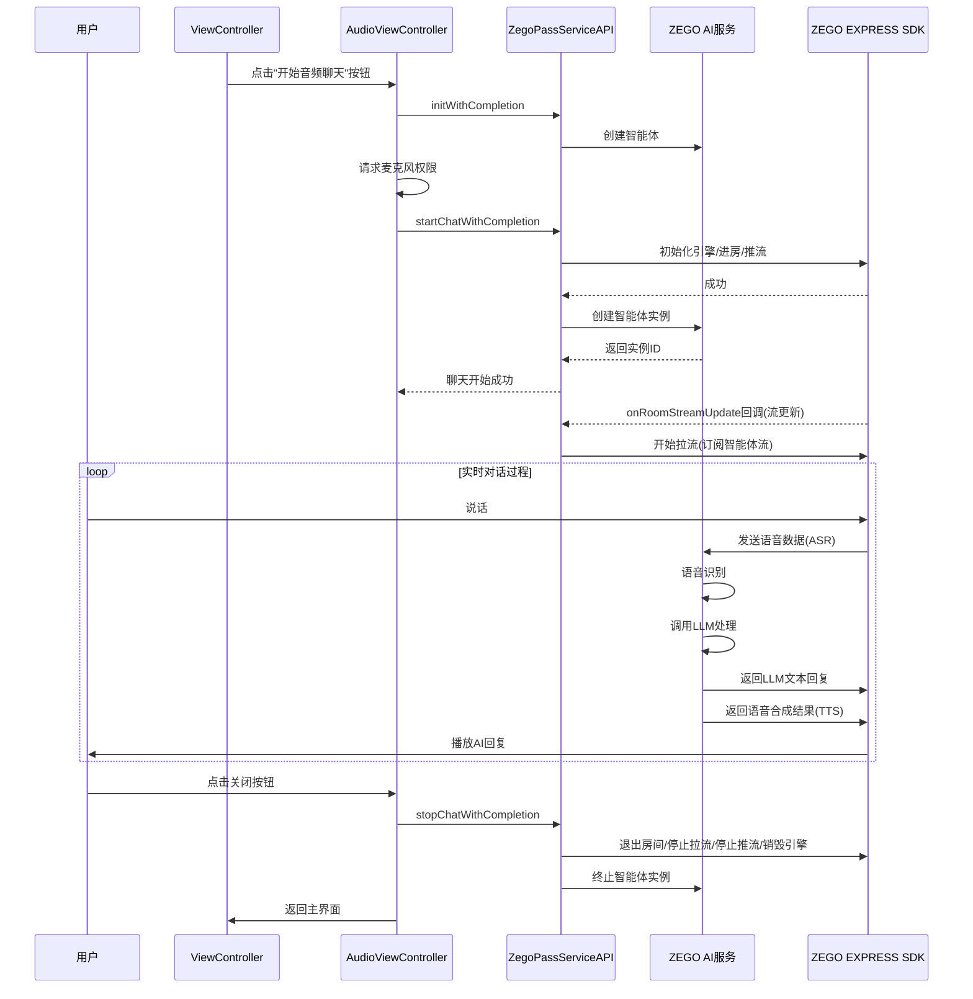

# AI Agent Quick Start

## 项目概述

这是一个AI语音智能助手（Agent）的Quick Start项目，基于iOS平台开发，允许用户通过语音与AI智能体进行交互。项目实现了语音识别(ASR)、自然语言处理(LLM)和语音合成(TTS)的完整流程，支持实时语音对话和字幕显示。

## 技术栈

- 开发语言：Objective-C
- 平台：iOS
- 依赖库：Masonry（UI布局）、AVFoundation（音频处理）
- 服务：ZEGO AI Agent服务

## 项目结构

```
ai_agent_quickstart/
├── AppDelegate.h/m           # 应用程序代理
├── SceneDelegate.h/m         # 场景代理 
├── ViewController.h/m        # 主视图控制器（入口界面）
├── aiagent/                  # AI Agent核心模块
│   ├── audio/                # 音频相关模块
│   │   ├── ZegoAIAgentAudioViewController.h/m  # 音频智能体对话视图控制器
│   │   └── views/            # 音频UI组件
│   │       ├── ZegoAIAgentAudioSubtitlesForegroundView.h/m  # 前景UI
│   │       ├── ZegoAIAgentStatusView.h/m                    # 状态显示UI
│   │       └── subtitles/    # 字幕相关组件
│   │           ├── ZegoAIAgentSubtitlesTableView.h/m        # 字幕视图
│   │           ├── core/     # 字幕核心处理
│   │           ├── views/    # 字幕UI组件
│   │           └── protocol/ # 字幕相关协议
│   └── pass_server/          # PASS服务接口
│       ├── ZegoPassServiceAPI.h/m                   # 服务API封装
│       ├── ZegoPassServiceProtocol.h/m              # 服务协议定义
│       ├── ZegoPassAgentConfig.h/m                  # 智能体配置
│       ├── ZegoPassKey.h/m                          # 密钥管理
│       ├── ZegoPassRegisterAgentRequest.h/m         # 注册智能体请求
│       ├── ZegoPassCreateAgentInstanceRequest.h/m   # 创建智能体实例请求
│       ├── ZegoPassCreateAgentInstanceResponse.h/m  # 创建智能体实例响应
│       └── ZegoPassDeleteAgentInstanceRequest.h/m   # 删除智能体实例请求
└── libs/                     # 第三方库
    └── Express/              # ZEGO Express SDK
```

## 流程说明

### 应用启动流程

1. 应用启动，初始化AppDelegate和SceneDelegate
2. 加载主界面ViewController，显示音频聊天按钮

### 音频对话流程



## 主要组件说明

### 1. ZegoPassServiceAPI

提供与ZEGO AI服务交互的接口，包括初始化、创建智能体实例、开始聊天和结束聊天。

### 2. ZegoAIAgentAudioViewController

音频对话界面控制器，负责处理用户交互、权限请求和音频流程管理。

### 3. ZegoAIAgentSubtitlesTableView

字幕显示组件，实现对话内容的实时显示，包括用户输入和AI回复。

### 4. ZegoPassAgentConfig

AI智能体配置类，包含LLM、TTS和ASR相关配置。

## 使用说明

1. 克隆项目到本地
2. 使用XCode打开项目
3. 配置AppID和密钥
   - 前往 [ZEGO 控制台](https://console.zegocloud.com/) 创建项目.
   - 获取 **AppID**，**AppSign** 和**AppSecret**
   - 复制`ZegoPassKey.template.m`（位于`ai_agent_quickstart/aiagent/pass_server/`目录）文件并重命名为`ZegoPassKey.m`
   - 使用自己的密钥信息填充该文件
4. 构建并运行项目
5. 在主界面点击"开始音频聊天"按钮开始体验
## 注意事项

- 使用前需要在Info.plist中添加麦克风权限声明
- 需要有效的ZEGO账号和AppID以使用AI服务
- 网络环境会影响语音交互的流畅度
