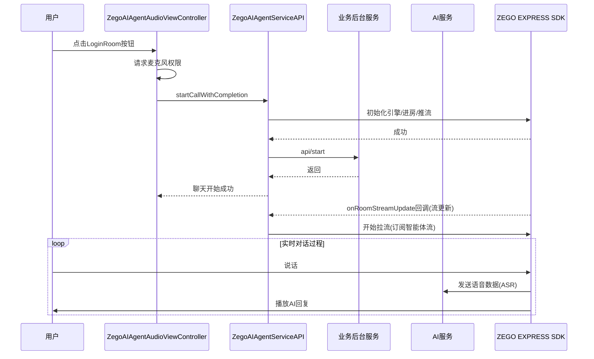
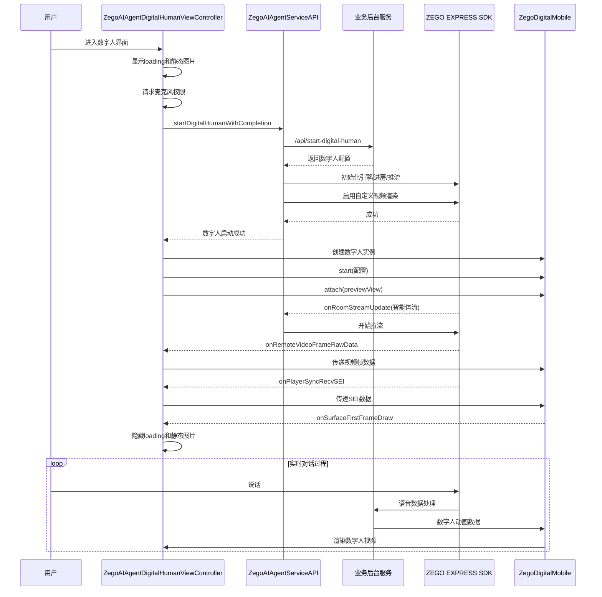

# AI Agent Quick Start

## 项目概述

这是一个AI语音智能助手（Agent）的Quick Start项目，基于iOS平台开发，允许用户通过语音与AI智能体进行交互。项目实现了语音识别(ASR)、自然语言处理(LLM)和语音合成(TTS)的完整流程，支持实时语音对话、字幕显示和数字人交互。

⚠️ 在运行客户端前，请先启动[您的业务后台](https://github.com/ZEGOCLOUD/ai_agent_quick_start_server/tree/main)，分支需和客户端匹配

## 技术栈

- 开发语言：Objective-C
- 平台：iOS
- 依赖库：Masonry（UI布局）、AVFoundation（音频处理）、ZegoDigitalMobile（数字人渲染）
- 服务：ZEGO AI Agent服务、ZEGO Express SDK

## 项目结构

```
ai_agent_quickstart/
├── AppDelegate.h/m           # 应用程序代理
├── SceneDelegate.h/m         # 场景代理 
├── aiagent/                  # AI Agent核心模块
│   ├── audio/                # 音频相关模块
│   │   ├── ZegoAIAgentAudioViewController.h/m  # 音频智能体对话视图控制器（主界面）
│   │   └── views/            # 音频UI组件
│   │       └── subtitles/    # 字幕相关组件
│   │           ├── ZegoAIAgentSubtitlesTableView.h/m        # 字幕视图
│   │           ├── core/     # 字幕核心处理
│   │           ├── views/    # 字幕UI组件
│   │           └── protocol/ # 字幕相关协议
│   ├── digital_human/        # 数字人相关模块
│   │   ├── ZegoAIAgentDigitalHumanViewController.h/m  # 数字人智能体对话视图控制器
│   │   └── ZegoAIAgentDigitalHumanEventHandler.h      # 数字人事件处理协议
│   └── server/               # 后台服务接口
│       ├── ZegoAIAgentServiceAPI.h/m                # 服务API封装
│       └── ZegoKey.h/m                              # 密钥管理
│          └── protocol/      # 后台服务协议
│              ├── ZegoAIGetTokenRequest.h/m         # Token请求
│              ├── ZegoAIGetTokenResponse.h/m        # Token回包
└── libs/                     # 第三方库
    ├── Express/              # ZEGO Express SDK
    └── ZegoDigitalMobile/    # ZEGO 数字人SDK
```

## 流程说明

### 应用启动流程

1. 请先启动[您的业务后台](https://github.com/ZEGOCLOUD/ai_agent_quick_start_server/tree/main)，分支需和客户端匹配
2. 应用启动，初始化AppDelegate和SceneDelegate
3. SceneDelegate直接加载ZegoAIAgentAudioViewController为根视图控制器，进入主界面

### 音频对话流程


```mermaid
sequenceDiagram
    participant User as 用户
    participant AudioVC as ZegoAIAgentAudioViewController
    participant ServiceAPI as ZegoAIAgentServiceAPI
    participant BusinessServer as 业务后台服务
    participant PassServer as AI服务
    participant Express as ZEGO EXPRESS SDK

    User->>AudioVC: 点击LoginRoom按钮
    AudioVC->>AudioVC: 请求麦克风权限
    AudioVC->>ServiceAPI:startCallWithCompletion
    ServiceAPI->>Express: 初始化引擎/进房/推流
    Express-->>ServiceAPI: 成功
    ServiceAPI->>BusinessServer: api/start
    BusinessServer-->>ServiceAPI: 返回
    ServiceAPI-->>AudioVC: 聊天开始成功
    Express-->>ServiceAPI: onRoomStreamUpdate回调(流更新)
    ServiceAPI->>Express: 开始拉流(订阅智能体流)
  
    loop 实时对话过程
        User->>Express: 说话
        Express->>PassServer: 发送语音数据(ASR)
        Express->>User: 播放AI回复
    end
```

### 数字人对话流程


```mermaid
sequenceDiagram
    participant User as 用户
    participant DigitalVC as ZegoAIAgentDigitalHumanViewController
    participant ServiceAPI as ZegoAIAgentServiceAPI
    participant BusinessServer as 业务后台服务
    participant Express as ZEGO EXPRESS SDK
    participant DigitalMobile as ZegoDigitalMobile

    User->>DigitalVC: 进入数字人界面
    DigitalVC->>DigitalVC: 显示loading和静态图片
    DigitalVC->>DigitalVC: 请求麦克风权限
    DigitalVC->>ServiceAPI: startDigitalHumanWithCompletion
    ServiceAPI->>BusinessServer: /api/start-digital-human
    BusinessServer-->>ServiceAPI: 返回数字人配置
    ServiceAPI->>Express: 初始化引擎/进房/推流
    ServiceAPI->>Express: 启用自定义视频渲染
    Express-->>ServiceAPI: 成功
    ServiceAPI-->>DigitalVC: 数字人启动成功
    
    DigitalVC->>DigitalMobile: 创建数字人实例
    DigitalVC->>DigitalMobile: start(配置)
    DigitalVC->>DigitalMobile: attach(previewView)
    
    Express-->>ServiceAPI: onRoomStreamUpdate(智能体流)
    ServiceAPI->>Express: 开始拉流
    Express-->>DigitalVC: onRemoteVideoFrameRawData
    DigitalVC->>DigitalMobile: 传递视频帧数据
    Express-->>DigitalVC: onPlayerSyncRecvSEI
    DigitalVC->>DigitalMobile: 传递SEI数据
    
    DigitalMobile-->>DigitalVC: onSurfaceFirstFrameDraw
    DigitalVC->>DigitalVC: 隐藏loading和静态图片
    
    loop 实时对话过程
        User->>Express: 说话
        Express->>BusinessServer: 语音数据处理
        BusinessServer->>DigitalMobile: 数字人动画数据
        DigitalMobile->>DigitalVC: 渲染数字人视频
    end
```

## 主要组件说明

### 1. ZegoAIAgentServiceAPI

提供与ZEGO AI服务交互的接口，包括初始化、创建智能体实例、开始聊天和结束聊天。

#### 核心方法

- `startAudioWithCompletion:` - 开始音频对话
- `stopAudioWithCompletion:` - 停止音频对话  
- `startDigitalHumanWithCompletion:` - 开始数字人对话
- `stopDigitalHumanWithCompletion:` - 停止数字人对话

#### 后台交互接口协议

##### 1. 获取Token接口
- **接口**: `GET /api/zego-token?userId={userId}`
- **功能**: 获取ZEGO Express SDK所需的认证token
- **响应**: 返回token信息用于SDK初始化

##### 2. 开始音频对话接口
- **接口**: `POST /api/start`
- **参数**: 
  ```json
  {
    "room_id": "房间ID",
    "user_id": "用户ID", 
    "user_stream_id": "用户流ID"
  }
  ```
- **功能**: 创建音频智能体实例并开始对话
- **响应**: 返回智能体信息(agent_id, agent_stream_id等)

##### 3. 开始数字人对话接口
- **接口**: `POST /api/start-digital-human`
- **参数**:
  ```json
  {
    "room_id": "房间ID",
    "user_id": "用户ID",
    "user_stream_id": "用户流ID", 
    "digital_human_id": "数字人ID",
    "config_id": "配置ID"
  }
  ```
- **功能**: 创建数字人智能体实例并开始对话
- **响应**: 返回智能体信息和数字人配置(digital_human_config)

##### 4. 停止对话接口
- **接口**: `POST /api/stop`
- **参数**:
  ```json
  {
    "agent_instance_id": "智能体实例ID"
  }
  ```
- **功能**: 停止智能体对话并清理资源

### 2. ZegoAIAgentAudioViewController

音频对话主界面控制器，负责处理用户交互、权限请求和音频流程管理。应用启动后直接进入本界面。

### 3. ZegoAIAgentDigitalHumanViewController

数字人对话界面控制器，负责数字人视频渲染、音频交互和生命周期管理。

#### 核心功能
- 静态图片加载和显示(加载时占位)
- 数字人视频流渲染
- 音频权限管理
- Loading状态管理
- 视频帧数据和SEI数据处理

### 4. ZegoAIAgentSubtitlesTableView

字幕显示组件，实现对话内容的实时显示，包括用户输入和AI回复。可通过主界面subtitles tab展开/收起。

## 使用说明

1. 克隆项目到本地
2. 使用XCode打开项目
3. 配置AppID和密钥
   - 前往 [ZEGO 控制台](https://console.zegocloud.com/) 创建项目.
   - 获取 **AppID**，**AppSign** 和**AppSecret**
   - 复制 `ZegoKey.template.m`（位于 `ai_agent_quickstart/aiagent/server/`目录）文件并重命名为 `ZegoKey.m`
   - 使用自己的密钥信息填充该文件，包括数字人ID和静态图片URL
4. 构建并运行项目
5. 启动后直接进入主界面体验

## 注意事项

- 使用前需要在Info.plist中添加麦克风权限声明
- 需要有效的ZEGO账号和AppID以使用AI服务
- 数字人功能需要配置有效的数字人ID和静态图片URL
- 网络环境会影响语音交互和数字人渲染的流畅度
