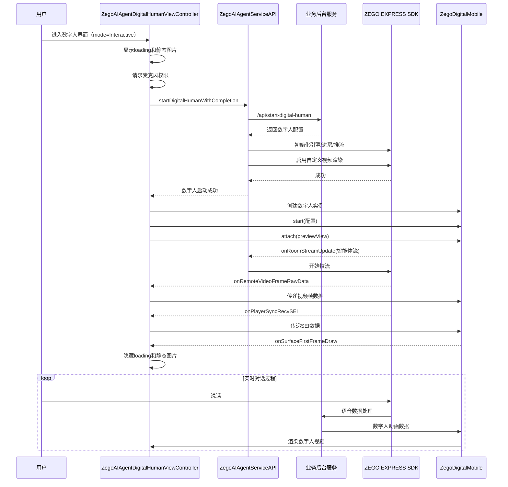
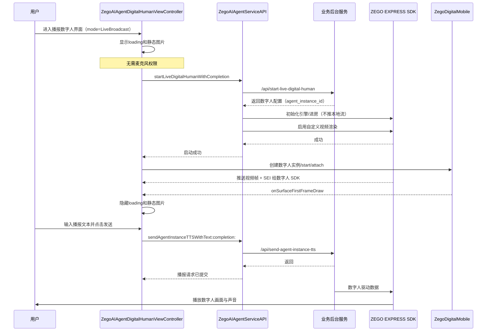

# 跑通示例代码

[](./README_EN.md) [](./README.md)

## 概述

ZEGO 实时互动 AI Agent（下文简称"互动AI"或"AI Agent"），通过接入SDK及服务端 API，即可快速实现用户与 AI（智能体）进行超低延迟的 IM 图文聊天、语音通话、数字人语音通话等互动能力，从而满足 AI 陪伴、AI 客服、AI 数字人直播等场景。 ZEGO AI Agent 支持自定义设置人设、音色、形象等，支持多家大语言模型（LLM）、文本转换语音服务（TTS），且并支持长期记忆、外挂知识库、模型精调，从而实现更完美的智能体。

本文介绍如何跑通 iOS 平台的示例代码，连接到 AI Agent 测试业务服务，体验以下三种能力：

- **语音通话**：与 AI 智能体进行纯语音对话
- **数字人视频通话**：与数字人进行双向音视频互动
- **播报数字人**：单向观看数字人播报，支持主动下发 TTS 文本

⚠️ 在运行客户端前，请先启动[您的业务后台](https://github.com/ZEGOCLOUD/ai_agent_quick_start_server/tree/main)，分支需和客户端匹配

## 前提条件

- 已在 [ZEGO 控制台](https://console.zego.im/) 创建项目，并申请有效的 AppID 和 AppSign，详情请参考 [控制台 - 项目信息](https://doc-zh.zego.im/article/12107)。
- 已联系 ZEGO 技术支持开通数字人 PaaS 服务和相关接口的权限（语音通话场景无需此步）。
- 已联系 ZEGO 技术支持创建数字人（数字人相关场景需要）。
- 已联系 ZEGO 技术支持获取支持 AI 回声消除的 [ZEGO Express SDK](https://doc-zh.zego.im/article/196)，并集成到您的项目中。

## 跑通步骤

1. 将 [ai_agent_quick_start](https://github.com/ZEGOCLOUD/ai_agent_quick_start)克隆或下载到本地
2. 在文件管理器或者Finder中将`/ios/ai_agent_quickstart/aiagent/server/ZegoKey.template.m`重命名为`ZegoKey.m`
3. 终端切换到`/ios`目录，执行`pod install`安装依赖库。在完成后，会生成`ai_agent_quickstart.xcworkspace`文件
4. 用XCode打开`ai_agent_quickstart.xcworkspace`文件，运行项目
5. 打开`/ios/ai_agent_quickstart/aiagent/server/ZegoKey.m`，填写`kZegoAppId`和`kBaseURL`
    > - `kZegoAppId` 可在 [ZEGO 控制台](https://console.zego.im) 的**项目概览**中查看。⚠️注意：必须与业务后台部署使用的AppID保持一致。
    >
    > - `kBaseURL` 为您的业务后台地址，请参考 [业务后台示例代码](https://github.com/ZEGOCLOUD/ai_agent_quick_start_server)部署好业务后台后，即可获取
    >
    > - 如需体验**播报数字人**能力，还需额外填写 `kDigitalHumanId`（联系 ZEGO 技术支持获取）
6. 在首页选择要体验的功能入口（语音通话 / 数字人视频通话 / 播报数字人）

## 关于示例代码的详细说明

<details>
<summary>点击查看详细说明</summary>

### 技术栈

- 开发语言：Objective-C
- 平台：iOS
- 依赖库：Masonry（UI布局）、AVFoundation（音频处理）、ZegoDigitalMobile（数字人渲染）
- 服务：ZEGO AI Agent服务、ZEGO Express SDK

### 项目结构

```
ai_agent_quickstart/
├── AppDelegate.h/m           # 应用程序代理
├── SceneDelegate.h/m         # 场景代理
├── ZegoAIAgentHomeViewController.h/m   # 首页入口控制器（语音通话 / 数字人视频通话 / 播报数字人）
├── aiagent/                  # AI Agent核心模块
│   ├── audio/                # 音频相关模块
│   │   ├── ZegoAIAgentAudioViewController.h/m     # 音频智能体对话视图控制器
│   │   ├── ZegoAIAgentAudioEventHandler.h          # 音频事件处理协议
│   │   └── subtitles/    # 字幕相关组件
│   │       ├── ZegoAIAgentSubtitlesTableView.h/m        # 字幕视图
│   │       ├── core/     # 字幕核心处理（颜色、定义）
│   │       ├── views/    # 字幕UI组件（Cell、Label、Model）
│   │       └── protocol/ # 字幕相关协议（事件、消息分发器、消息协议）
│   ├── digital_human/        # 数字人相关模块
│   │   ├── ZegoAIAgentDigitalHumanViewController.h/m  # 数字人视图控制器（含 Interactive / LiveBroadcast 两种模式）
│   │   └── ZegoAIAgentDigitalHumanEventHandler.h      # 数字人事件处理协议
│   └── server/               # 后台服务接口
│       ├── ZegoAIAgentServiceAPI.h/m                # 服务API封装（音频 / 数字人 / 播报数字人）
│       ├── ZegoKey.h/m                              # 密钥管理
│       └── protocol/      # 后台服务协议
│           ├── ZegoAIGetTokenRequest.h/m         # Token请求
│           ├── ZegoAIGetTokenResponse.h/m        # Token回包
│           └── ZegoAIServiceCommonResponse.h/m  # 通用回包
└── libs/                     # 第三方库
    ├── Express/              # ZEGO Express SDK
    └── ZegoDigitalMobile/    # ZEGO 数字人SDK
```

### 流程说明

#### 应用启动流程

1. 应用启动，初始化AppDelegate和SceneDelegate
2. SceneDelegate 加载 `ZegoAIAgentHomeViewController` 作为根视图控制器，进入首页
3. 用户在首页选择三种能力之一：
   - **StartAIAudioCall** → 跳转 `ZegoAIAgentAudioViewController`（音频对话）
   - **StartDigitalHumanCall** → 跳转 `ZegoAIAgentDigitalHumanViewController`（mode = Interactive，数字人视频通话）
   - **StartLiveDigitalHuman** → 跳转 `ZegoAIAgentDigitalHumanViewController`（mode = LiveBroadcast，播报数字人）

#### 音频对话流程


```mermaid
sequenceDiagram
    participant User as 用户
    participant AudioVC as ZegoAIAgentAudioViewController
    participant ServiceAPI as ZegoAIAgentServiceAPI
    participant BusinessServer as 业务后台服务
    participant PassServer as AI服务
    participant Express as ZEGO EXPRESS SDK

    User->>AudioVC: 点击"开始对话"按钮
    AudioVC->>AudioVC: 请求麦克风权限
    AudioVC->>ServiceAPI:startAudioWithCompletion
    ServiceAPI->>Express: 初始化引擎/进房/推流
    Express-->>ServiceAPI: 成功
    ServiceAPI->>BusinessServer: api/start
    BusinessServer-->>ServiceAPI: 返回
    ServiceAPI-->>AudioVC: 聊天开始成功
    Express-->>ServiceAPI: onRoomStreamUpdate回调(流更新)
    ServiceAPI->>Express: 开始拉流(订阅智能体流)

    loop 实时对话过程
        User->>Express: 说话
        Express->>PassServer: 发送语音数据(ASR)
        Express->>User: 播放AI回复
    end
```

#### 数字人视频通话流程


```mermaid
sequenceDiagram
    participant User as 用户
    participant DigitalVC as ZegoAIAgentDigitalHumanViewController
    participant ServiceAPI as ZegoAIAgentServiceAPI
    participant BusinessServer as 业务后台服务
    participant Express as ZEGO EXPRESS SDK
    participant DigitalMobile as ZegoDigitalMobile

    User->>DigitalVC: 进入数字人界面（mode=Interactive）
    DigitalVC->>DigitalVC: 显示loading和静态图片
    DigitalVC->>DigitalVC: 请求麦克风权限
    DigitalVC->>ServiceAPI: startDigitalHumanWithCompletion
    ServiceAPI->>BusinessServer: /api/start-digital-human
    BusinessServer-->>ServiceAPI: 返回数字人配置
    ServiceAPI->>Express: 初始化引擎/进房/推流
    ServiceAPI->>Express: 启用自定义视频渲染
    Express-->>ServiceAPI: 成功
    ServiceAPI-->>DigitalVC: 数字人启动成功

    DigitalVC->>DigitalMobile: 创建数字人实例
    DigitalVC->>DigitalMobile: start(配置)
    DigitalVC->>DigitalMobile: attach(previewView)

    Express-->>ServiceAPI: onRoomStreamUpdate(智能体流)
    ServiceAPI->>Express: 开始拉流
    Express-->>DigitalVC: onRemoteVideoFrameRawData
    DigitalVC->>DigitalMobile: 传递视频帧数据
    Express-->>DigitalVC: onPlayerSyncRecvSEI
    DigitalVC->>DigitalMobile: 传递SEI数据

    DigitalMobile-->>DigitalVC: onSurfaceFirstFrameDraw
    DigitalVC->>DigitalVC: 隐藏loading和静态图片

    loop 实时对话过程
        User->>Express: 说话
        Express->>BusinessServer: 语音数据处理
        BusinessServer->>DigitalMobile: 数字人动画数据
        DigitalMobile->>DigitalVC: 渲染数字人视频
    end
```

#### 播报数字人流程


```mermaid
sequenceDiagram
    participant User as 用户
    participant DigitalVC as ZegoAIAgentDigitalHumanViewController
    participant ServiceAPI as ZegoAIAgentServiceAPI
    participant BusinessServer as 业务后台服务
    participant Express as ZEGO EXPRESS SDK
    participant DigitalMobile as ZegoDigitalMobile

    User->>DigitalVC: 进入播报数字人界面（mode=LiveBroadcast）
    DigitalVC->>DigitalVC: 显示loading和静态图片
    Note over DigitalVC: 无需麦克风权限
    DigitalVC->>ServiceAPI: startLiveDigitalHumanWithCompletion
    ServiceAPI->>BusinessServer: /api/start-live-digital-human
    BusinessServer-->>ServiceAPI: 返回数字人配置（agent_instance_id）
    ServiceAPI->>Express: 初始化引擎/进房（不推本地流）
    ServiceAPI->>Express: 启用自定义视频渲染
    Express-->>ServiceAPI: 成功
    ServiceAPI-->>DigitalVC: 启动成功

    DigitalVC->>DigitalMobile: 创建数字人实例/start/attach
    Express-->>DigitalVC: 推送视频帧 + SEI 给数字人 SDK
    DigitalMobile-->>DigitalVC: onSurfaceFirstFrameDraw
    DigitalVC->>DigitalVC: 隐藏loading和静态图片

    User->>DigitalVC: 输入播报文本并点击发送
    DigitalVC->>ServiceAPI: sendAgentInstanceTTSWithText:completion:
    ServiceAPI->>BusinessServer: /api/send-agent-instance-tts
    BusinessServer-->>ServiceAPI: 返回
    ServiceAPI-->>DigitalVC: 播报请求已提交
    BusinessServer->>Express: 数字人驱动数据
    Express->>User: 播放数字人画面与声音
```

### 主要组件说明

#### ZegoAIAgentServiceAPI

提供与ZEGO AI服务交互的接口，包括初始化、创建智能体实例、开始聊天和结束聊天。

**核心方法**

- `startAudioWithCompletion:` / `stopAudioWithCompletion:` - 开始/停止音频对话
- `startDigitalHumanWithCompletion:` / `stopDigitalHumanWithCompletion:` - 开始/停止数字人视频通话
- `startLiveDigitalHumanWithCompletion:` / `stopLiveDigitalHumanWithCompletion:` - 开始/停止播报数字人
- `sendAgentInstanceTTSWithText:completion:` - 向播报数字人下发 TTS 文本
- `getTokenWithCompletion:` - 获取 Token
- `ensureLogoutRoom` - 幂等退出 RTC 房间（兜底）

#### ZegoAIAgentHomeViewController

首页入口控制器，提供三种 AI 能力的导航按钮：语音通话、数字人视频通话、播报数字人。应用启动后直接进入本界面。

#### ZegoAIAgentAudioViewController

音频对话主界面控制器，负责处理用户交互、权限请求和音频流程管理。从首页 `StartAIAudioCall` 入口跳转。

#### ZegoAIAgentDigitalHumanViewController

数字人对话界面控制器，负责数字人视频渲染、音频交互和生命周期管理。通过 `mode` 属性区分两种形态：

- `ZegoAIAgentDigitalHumanModeInteractive` - 数字人视频通话（双向音视频）
- `ZegoAIAgentDigitalHumanModeLiveBroadcast` - 播报数字人（单向观看 + 主动 TTS）

**核心功能**
- 静态图片加载和显示(加载时占位)
- 数字人视频流渲染
- 音频权限管理（播报模式无需）
- Loading状态管理
- 视频帧数据和SEI数据处理
- 主动 TTS 文本下发（仅播报模式）

#### ZegoAIAgentSubtitlesTableView

字幕显示组件，实现对话内容的实时显示，包括用户输入和AI回复。可通过主界面subtitles tab展开/收起。

#### ZegoKey

调试配置类，通过 `kZegoAppId`、`kBaseURL`、`kDigitalHumanId` 等常量集中管理接入参数。
</details>