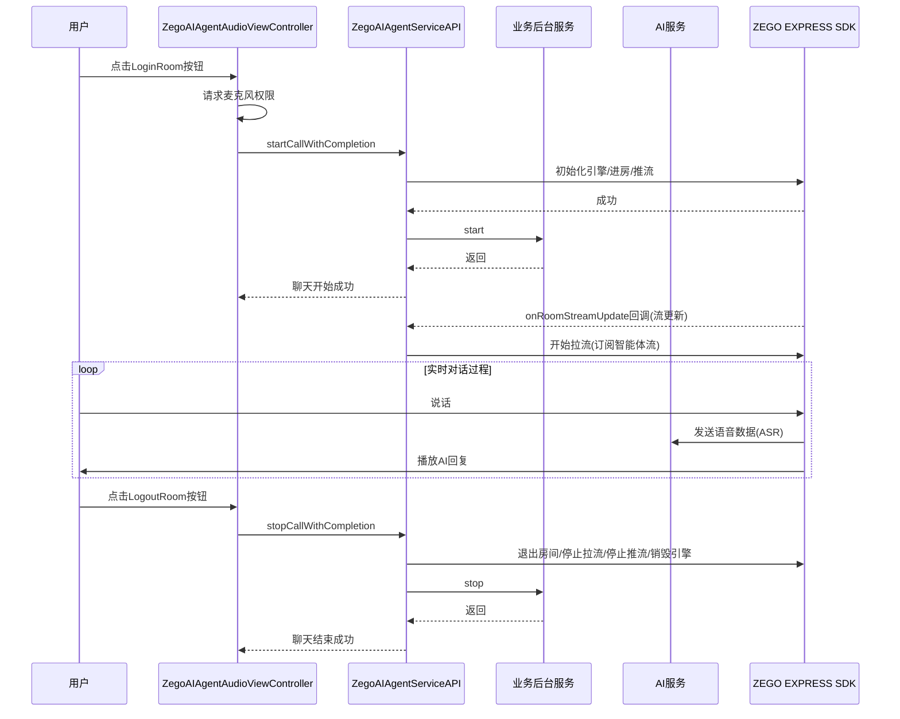

# AI Agent Quick Start

## 项目概述

这是一个AI语音智能助手（Agent）的Quick Start项目，基于iOS平台开发，允许用户通过语音与AI智能体进行交互。项目实现了语音识别(ASR)、自然语言处理(LLM)和语音合成(TTS)的完整流程，支持实时语音对话和字幕显示。

## 技术栈

- 开发语言：Objective-C
- 平台：iOS
- 依赖库：Masonry（UI布局）、AVFoundation（音频处理）
- 服务：ZEGO AI Agent服务

## 项目结构

```
ai_agent_quickstart/
├── AppDelegate.h/m           # 应用程序代理
├── SceneDelegate.h/m         # 场景代理 
├── aiagent/                  # AI Agent核心模块
│   ├── audio/                # 音频相关模块
│   │   ├── ZegoAIAgentAudioViewController.h/m  # 音频智能体对话视图控制器（主界面）
│   │   └── views/            # 音频UI组件
│   │       └── subtitles/    # 字幕相关组件
│   │           ├── ZegoAIAgentSubtitlesTableView.h/m        # 字幕视图
│   │           ├── core/     # 字幕核心处理
│   │           ├── views/    # 字幕UI组件
│   │           └── protocol/ # 字幕相关协议
│   └── server/               # 后台服务接口
│       ├── ZegoAIAgentServiceAPI.h/m                # 服务API封装
│       └── ZegoKey.h/m                              # 密钥管理
│          └── protocol/      # 后台服务协议
│              ├── ZegoAIGetTokenRequest.h/m         # Token请求
│              ├── ZegoAIGetTokenResponse.h/m        # Token回包
└── libs/                     # 第三方库
    └── Express/              # ZEGO Express SDK
```

## 流程说明

### 应用启动流程

1. 应用启动，初始化AppDelegate和SceneDelegate
2. SceneDelegate直接加载ZegoAIAgentAudioViewController为根视图控制器，进入主界面

### 音频对话流程


```mermaid
sequenceDiagram
    participant User as 用户
    participant AudioVC as ZegoAIAgentAudioViewController
    participant ServiceAPI as ZegoAIAgentServiceAPI
    participant BusinessServer as 业务后台服务
    participant PassServer as AI服务
    participant Express as ZEGO EXPRESS SDK

    User->>AudioVC: 点击LoginRoom按钮
    AudioVC->>AudioVC: 请求麦克风权限
    AudioVC->>ServiceAPI:startCallWithCompletion
    ServiceAPI->>Express: 初始化引擎/进房/推流
    Express-->>ServiceAPI: 成功
    ServiceAPI->>BusinessServer: start
    BusinessServer-->>ServiceAPI: 返回
    ServiceAPI-->>AudioVC: 聊天开始成功
    Express-->>ServiceAPI: onRoomStreamUpdate回调(流更新)
    ServiceAPI->>Express: 开始拉流(订阅智能体流)
  
    loop 实时对话过程
        User->>Express: 说话
        Express->>PassServer: 发送语音数据(ASR)
       Express->>User: 播放AI回复
    end
  
    User->>AudioVC: 点击LogoutRoom按钮
    AudioVC->>ServiceAPI:stopCallWithCompletion
    ServiceAPI->>Express: 退出房间/停止拉流/停止推流/销毁引擎
    ServiceAPI->>BusinessServer: stop
    BusinessServer-->>ServiceAPI: 返回
    ServiceAPI-->>AudioVC: 聊天结束成功
```

## 主要组件说明

### 1. ZegoAIAgentServiceAPI

提供与ZEGO AI服务交互的接口，包括初始化、创建智能体实例、开始聊天和结束聊天。

### 2. ZegoAIAgentAudioViewController

音频对话主界面控制器，负责处理用户交互、权限请求和音频流程管理。应用启动后直接进入本界面。

### 3. ZegoAIAgentSubtitlesTableView

字幕显示组件，实现对话内容的实时显示，包括用户输入和AI回复。可通过主界面subtitles tab展开/收起。

## 使用说明

1. 克隆项目到本地
2. 使用XCode打开项目
3. 配置AppID和密钥
   - 前往 [ZEGO 控制台](https://console.zegocloud.com/) 创建项目.
   - 获取 **AppID**，**AppSign** 和**AppSecret**
   - 复制 `ZegoKey.template.m`（位于 `ai_agent_quickstart/aiagent/server/`目录）文件并重命名为 `ZegoKey.m`
   - 使用自己的密钥信息填充该文件
4. 构建并运行项目
5. 启动后直接进入主界面体验

## 注意事项

- 使用前需要在Info.plist中添加麦克风权限声明
- 需要有效的ZEGO账号和AppID以使用AI服务
- 网络环境会影响语音交互的流畅度
