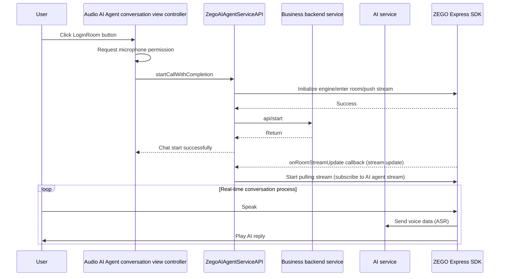
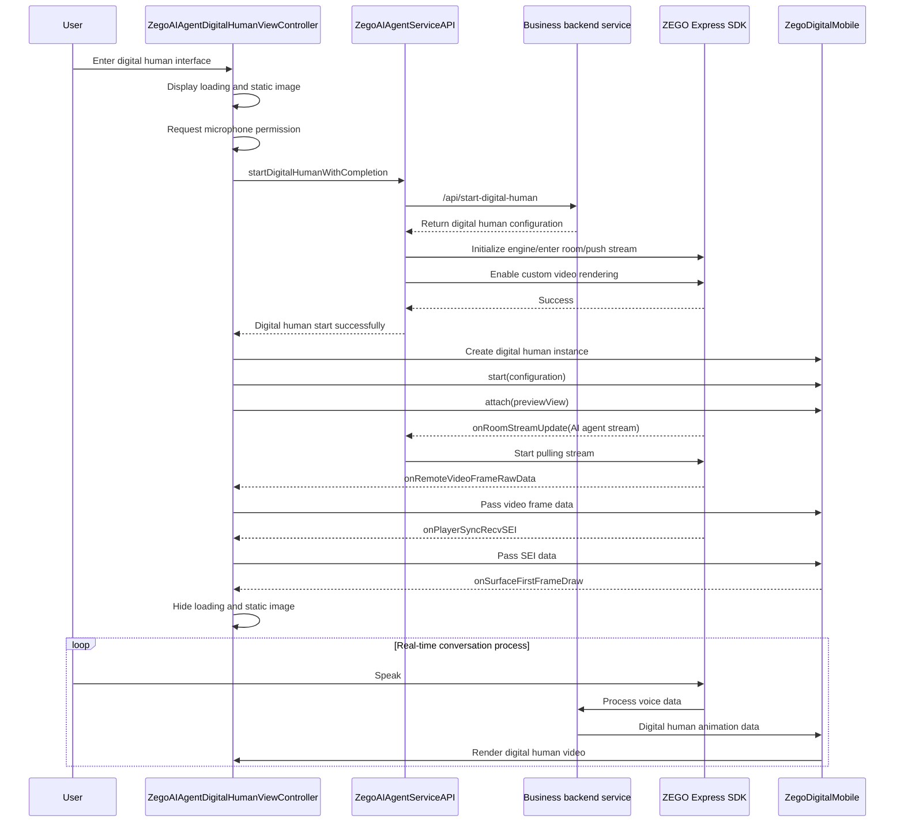

# Running the Sample Code

[](./README_EN.md) [](./README.md)

## Overview

ZEGOCLOUD Real-time Interactive AI Agent (hereinafter referred to as "Interactive AI" or "AI Agent"), by integrating SDK and server-side APIs, can quickly implement interactive capabilities such as ultra-low-latency IM text/image chat, voice calls, and digital human voice calls between users and AI (intelligent agents), thereby meeting scenarios such as AI companionship, AI customer service, and AI digital human live streaming. ZEGOCLOUD AI Agent supports custom settings for personality, voice, appearance, etc., supports multiple large language models (LLM), text-to-speech services (TTS), and also supports long-term memory, external knowledge bases, and model fine-tuning, thus achieving more perfect intelligent agents.

This article introduces how to run the sample code on the iOS platform, connect to the AI Agent test business service, and implement voice conversations with digital humans.

## Prerequisites

- You have already created a project in the [ZEGOCLOUD Console](https://console.zegocloud.com/) and applied for valid `AppID` and `Server URL`.
- You have contacted ZEGOCLOUD technical support to enable Digital human AI service and related interface permissions.
- You have contacted ZEGOCLOUD technical support to create a digital human.
- You have contacted ZEGOCLOUD technical support to obtain the [ZEGO Express SDK](https://www.zegocloud.com/docs/video-call/sdk-integration?platform=ios&language=objective-c) that supports AI echo cancellation, and integrated it into your project.

## Run the sample code

1. Clone or download [ai_agent_quick_start](https://github.com/ZEGOCLOUD/ai_agent_quick_start) to your local.
2. Rename `ZegoKey.template.m` to `ZegoKey.m` in the file manager or Finder.
3. Switch to the `/ios` directory in the terminal, and execute `pod install` to install the dependencies. After completion, it will generate the `ai_agent_quickstart.xcworkspace` file.
4. Open the `ai_agent_quickstart.xcworkspace` file with XCode, and run the project.
5. Open `/ios/ai_agent_quickstart/aiagent/server/ZegoKey.m`, and fill in `kZegoAppId` and `kBaseURL`.
    > - `kZegoAppId` can be viewed in the **Project Overview** section of the [ZEGOCLOUD Console](https://console.zegocloud.com/). ⚠️Note: It must be consistent with the AppID used by the business backend.
    >
    > - `kBaseURL` is the address of your business backend. After deploying the business backend, you can get it by referring to the [business backend sample code](https://github.com/ZEGOCLOUD/ai_agent_quick_start_server).

## Detailed description of the sample code

<details>
<summary>Click to view detailed description</summary>

### Technical stack

- Development language: Objective-C
- Platform: iOS
- Dependencies: Masonry (UI layout), AVFoundation (audio processing), ZegoDigitalMobile (digital human rendering)
- Services: ZEGO AI Agent service, ZEGO Express SDK

### Project structure

```
ai_agent_quickstart/
├── AppDelegate.h/m           # Application delegate
├── SceneDelegate.h/m         # Scene delegate
├── aiagent/                  # AI Agent core module
│   ├── audio/                # Audio related modules
│   │   ├── ZegoAIAgentAudioViewController.h/m  # Audio AI Agent conversation view controller (main interface)
│   │   └── views/            # Audio UI components
│   │       └── subtitles/    # Subtitles related components
│   │           ├── ZegoAIAgentSubtitlesTableView.h/m        # Subtitles view
│   │           ├── core/     # Subtitles core processing
│   │           ├── views/    # Subtitles UI components
│   │           └── protocol/ # Subtitles related protocols
│   ├── digital_human/        # Digital human related modules
│   │   ├── ZegoAIAgentDigitalHumanViewController.h/m  # Digital human AI Agent conversation view controller
│   │   └── ZegoAIAgentDigitalHumanEventHandler.h      # Digital human event handling protocol
│   └── server/               # Backend service interface
│       ├── ZegoAIAgentServiceAPI.h/m                # Service API encapsulation
│       └── ZegoKey.h/m                              # Key management
│          └── protocol/      # Backend service protocol
│              ├── ZegoAIGetTokenRequest.h/m         # Token request
│              ├── ZegoAIGetTokenResponse.h/m        # Token response
└── libs/                     # Third-party libraries
    ├── Express/              # ZEGO Express SDK
    └── ZegoDigitalMobile/    # ZEGO Digital human SDK
```

### Process description

#### Application startup process

1. Application startup, initialize AppDelegate and SceneDelegate
2. SceneDelegate directly loads ZegoAIAgentAudioViewController as the root view controller, and enters the main interface

#### Audio conversation process



#### Digital human conversation process



### Main components description

#### ZegoAIAgentServiceAPI

Provides interfaces for interacting with ZEGO AI service, including initialization, creating AI agent instances, starting chats, and ending chats.

**Core methods**

- `startAudioWithCompletion:` - Start audio conversation
- `stopAudioWithCompletion:` - Stop audio conversation
- `startDigitalHumanWithCompletion:` - Start digital human conversation
- `stopDigitalHumanWithCompletion:` - Stop digital human conversation


#### ZegoAIAgentAudioViewController

Audio conversation main interface controller, responsible for handling user interactions, permission requests, and audio process management. It directly enters this interface after application startup.

#### ZegoAIAgentDigitalHumanViewController

Digital human conversation interface controller, responsible for digital human video rendering, audio interaction, and lifecycle management.

**Core functions**
- Static image loading and display (placeholder when loading)
- Digital human video stream rendering
- Audio permission management
- Loading status management
- Video frame data and SEI data processing

#### ZegoAIAgentSubtitlesTableView

Subtitles display component, implementing real-time display of conversation content, including user input and AI replies. It can be expanded/collapsed by the subtitles tab on the main interface.
</details>


