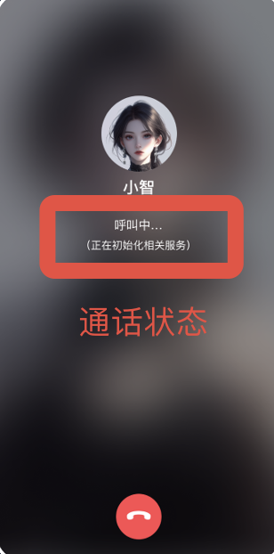
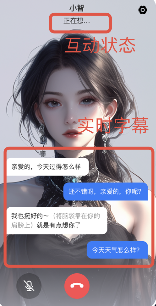
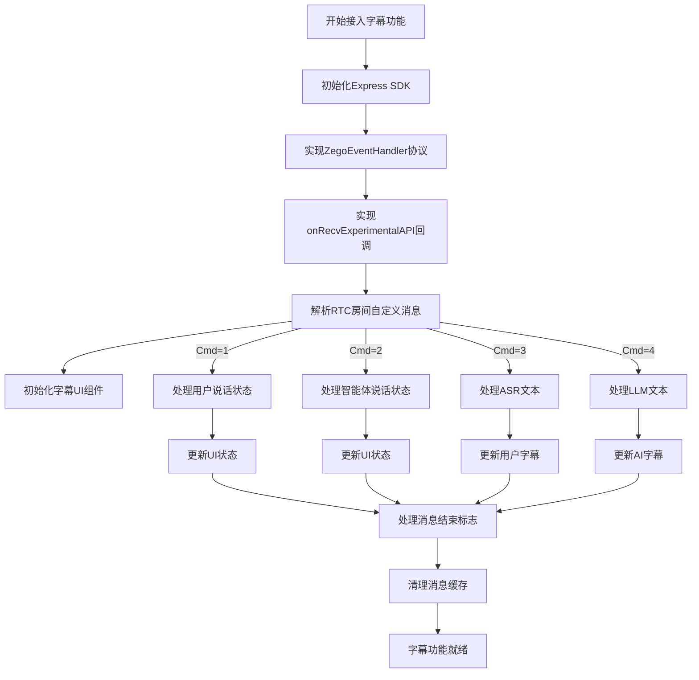
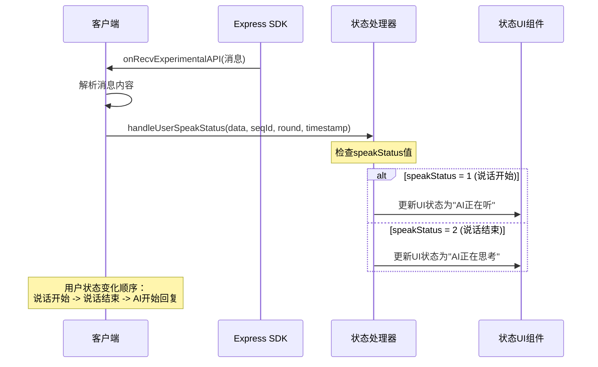
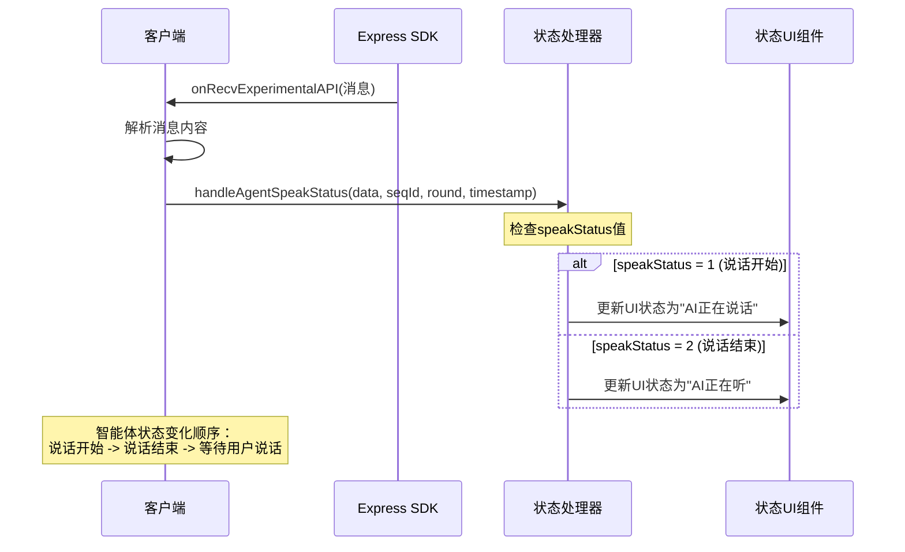
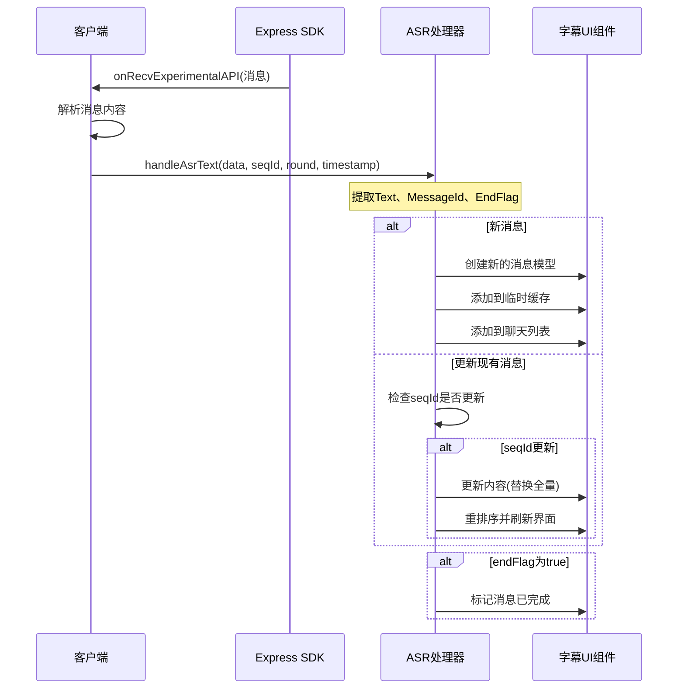
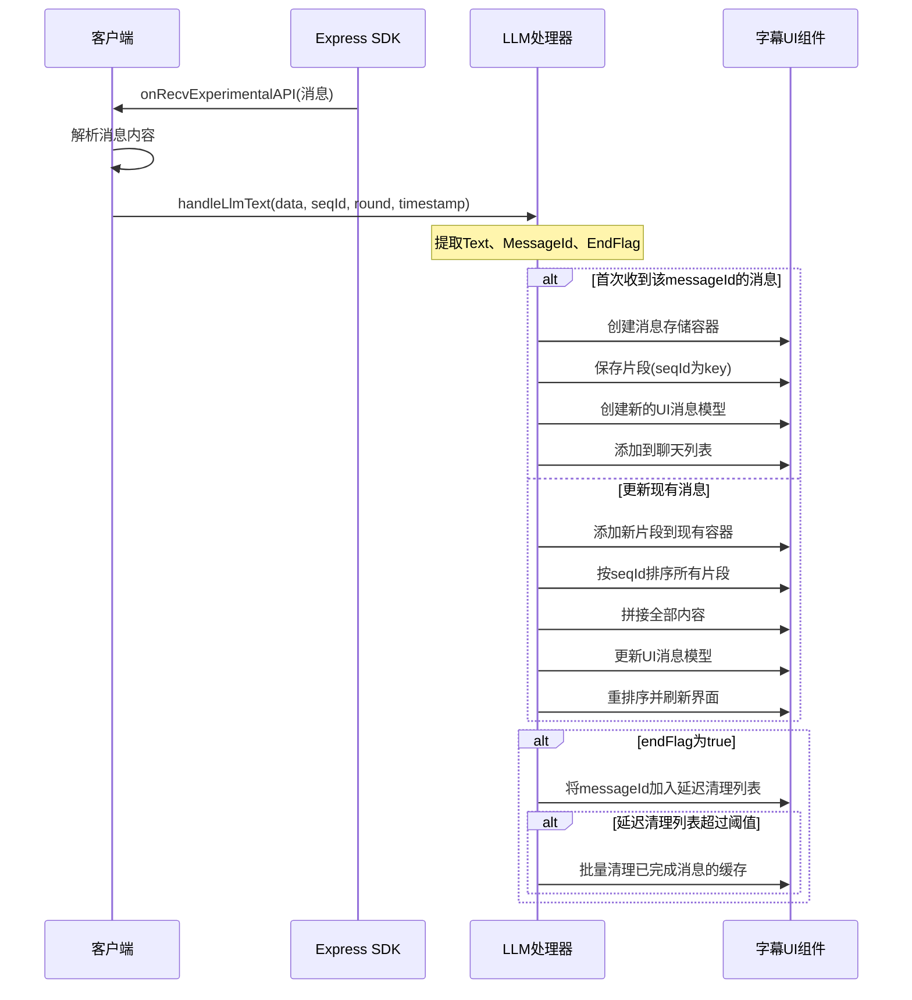
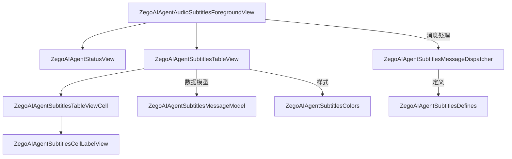

# AI语音通话实时字幕功能接入文档

## 1. 功能概述

用户在与AI语音通话的过程中，若需要在UI上展示过程中，展示以下内容：

* 通话状态：

  * 呼叫中（服务初始化中）
  * 呼叫成功（服务初始化完成，可以开始互动）
* 互动状态：

  * AI说话状态：正在说话，未说话。
  * 用户状态：正在说话；未说话。
* 实时字幕：

  * 用户内容：流式展示用户正在说的话（语音识别的实时结果）
  * AI回应内容：流式展示AI输出的内容（大语言模型实时的输出结果）】

  

## 前提条件

已经集成 AI Agent 并且可以进行语音聊天。

## 实现字幕

### 完整流程图


### 协议说明

#### RTC房间事件消息协议

用户与Agent进行语音对话期间，服务端通过RTC房间自定义消息下发状态信息，如用户说话状态、机器人说话状态、ASR识别文本、大模型回答的文本等。客户端监听房间自定义消息，解析对应的状态事件来渲染UI。

协议基本结构：

| 参数      | 类型   | 描述                                                                              |
| --------- | ------ | --------------------------------------------------------------------------------- |
| Timestamp | int64  | 时间戳，秒级别                                                                    |
| SeqId     | int64  | 包序列号，保证有序性，不保证连续性                                                |
| Round     | int64  | 对话轮次，每次用户主动说话轮次增加                                                |
| Cmd       | int    | 1:用户说话状态 `<br>`2:智能体说话状态 `<br>`3:识别的ASR文本 `<br>`4:LLM文本 |
| Data      | Object | 具体内容，各Cmd对应不同Data                                                       |

##### 用户说话状态 (Cmd = 1)

| 参数        | 类型 | 描述                     |
| ----------- | ---- | ------------------------ |
| SpeakStatus | int  | 1: 说话开始, 2: 说话结束 |

##### 智能体说话状态 (Cmd = 2)

| 参数        | 类型 | 描述                     |
| ----------- | ---- | ------------------------ |
| SpeakStatus | int  | 1: 说话开始, 2: 说话结束 |

##### ASR用户语音文本 (Cmd = 3)

| 参数      | 类型   | 描述                                                       |
| --------- | ------ | ---------------------------------------------------------- |
| Text      | string | 用户语音asr文本 `<br>`每次下发的是全量文本，支持文本修正 |
| MessageId | string | 消息id，每轮 asr 文本消息id 唯一                           |
| EndFlag   | bool   | 结束标识，true表示本轮 asr 文本已处理完成                  |

##### LLM大模型文本 (Cmd = 4)

| 参数      | 类型   | 描述                                      |
| --------- | ------ | ----------------------------------------- |
| Text      | string | llm文本 `<br>`每次下发增量文本          |
| MessageId | string | 消息id，每轮 llm 文本消息id唯一           |
| EndFlag   | bool   | 结束标识，true表示本轮 llm 文本已处理完成 |

### 接入步骤

#### 监听SDK事件

实现ZegoEventHandler协议以接收RTC房间自定义消息：
> Express SDK的初始化部分在此处省略，假定已在应用启动过程中正确初始化

```objective-c
// 实现ZegoEventHandler协议
@interface YourService () <ZegoEventHandler>
@property (nonatomic, strong) YourViewController *youViewController;
@end

@implementation YourService

// 处理express onRecvExperimentalAPI接收到的消息
- (void)onRecvExperimentalAPI:(NSString *)content {
    // 转发给view解析消息内容
    [self.youViewController handleExpressExperimentalAPIContent:content];
}

@end // YourService implementation
```

```objective-c// 在头文件中实现ZegoEventHandler协议
@interface YourViewController () <ZegoEventHandler>

@end

@implementation YourViewController

// 在实现文件中
- (void)handleExpressExperimentalAPIContent:(NSString *)content {
    if (content == nil) {
        NSLog(@"接收到的内容为空");
        return;
    }
  
    // 解析JSON内容
    NSError *error;
    NSData *jsonData = [content dataUsingEncoding:NSUTF8StringEncoding];
    NSDictionary *contentDict = [NSJSONSerialization JSONObjectWithData:jsonData 
                                                        options:NSJSONReadingMutableContainers 
                                                          error:&error];
    if (error || !contentDict) {
        NSLog(@"JSON解析失败: %@", error);
        return;
    }
  
    // 检查是否为房间消息
    NSString *method = contentDict[@"method"];
    if (![method isEqualToString:@"liveroom.room.on_recive_room_channel_message"]) {
        return;
    }
  
    // 获取消息参数
    NSDictionary *params = contentDict[@"params"];
    if (!params) {
        return;
    }
  
    NSString *msgContent = params[@"msg_content"];
    NSString *sendIdName = params[@"send_idname"];
    NSString *sendNickname = params[@"send_nickname"];
    NSString *roomId = params[@"roomid"];
    
    if (!msgContent || !sendIdName || !roomId) {
         NSLog(@"parseExperimentalAPIContent 参数不完整: msgContent=%@, sendIdName=%@, roomId=%@",
                msgContent, sendIdName, roomId);
        return;
    }
    
    // 解析消息内容
    [self handleMessageContent:msgContent userID:sendIdName userName:sendNickname ?: @""];
}

// 处理消息内容
- (void)handleMessageContent:(NSString *)command userID:(NSString *)userID userName:(NSString *)userName{
    NSDictionary* msgDict = [self dictFromJson:command];
    if (!msgDict) {
        return;
    }
  
    // 解析基本信息
    int cmd = [msgDict[@"Cmd"] intValue];
    int64_t seqId = [msgDict[@"SeqId"] longLongValue];
    int64_t round = [msgDict[@"Round"] longLongValue];
    int64_t timestamp = [msgDict[@"Timestamp"] longLongValue];
    NSDictionary *data = msgDict[@"Data"];
  
    // 根据命令类型处理消息
    switch (cmd) {
        case 1: // 用户说话状态
            [self handleUserSpeakStatus:data seqId:seqId round:round timestamp:timestamp];
            break;
        case 2: // 智能体说话状态
            [self handleAgentSpeakStatus:data seqId:seqId round:round timestamp:timestamp];
            break;
        case 3: // ASR文本
            [self handleAsrText:data seqId:seqId round:round timestamp:timestamp];
            break;
        case 4: // LLM文本
            [self handleLlmText:data seqId:seqId round:round timestamp:timestamp];
            break;
    }
}

@end // YourViewController implementation
```

#### 消息处理核心逻辑

以下是处理不同类型消息的核心逻辑：

##### 用户说话状态处理 (Cmd=1)

```objective-c
- (void)handleUserSpeakStatus:(NSDictionary *)data seqId:(int64_t)seqId round:(int64_t)round timestamp:(int64_t)timestamp {
    int speakStatus = [data[@"SpeakStatus"] intValue];
  
    if (speakStatus == 1) { // 说话开始
        // 用户开始说话，UI更新显示"正在听"状态
    } else if (speakStatus == 2) { // 说话结束
        // 用户结束说话，UI更新显示"正在想"状态
    }
}
```

用户说话状态处理序列图：



##### 智能体说话状态处理 (Cmd=2)

```objective-c
- (void)handleAgentSpeakStatus:(NSDictionary *)data seqId:(int64_t)seqId round:(int64_t)round timestamp:(int64_t)timestamp {
    int speakStatus = [data[@"SpeakStatus"] intValue];
  
    if (speakStatus == 1) { // 说话开始
        // AI开始说话，UI更新显示"正在讲"状态
    } else if (speakStatus == 2) { // 说话结束
        // AI结束说话，UI更新恢复"正在听"状态
    }
}
```

智能体说话状态处理序列图：



##### ASR文本处理 (Cmd=3)

```objective-c
- (void)handleAsrText:(NSDictionary *)data seqId:(int64_t)seqId round:(int64_t)round timestamp:(int64_t)timestamp {
    NSString *content = data[@"Text"];
    NSString *messageId = data[@"MessageId"];
    BOOL endFlag = [data[@"EndFlag"] boolValue];
  
    if (content && content.length > 0) {
        // 处理ASR消息并更新UI
    }
}
```

ASR文本处理序列图：



##### LLM文本处理 (Cmd=4)

```objective-c
- (void)handleLlmText:(NSDictionary *)data seqId:(int64_t)seqId round:(int64_t)round timestamp:(int64_t)timestamp {
    NSString *content = data[@"Text"];
    NSString *messageId = data[@"MessageId"];
    BOOL endFlag = [data[@"EndFlag"] boolValue];
  
    if (content && content.length > 0) {
        // 处理LLM消息并更新UI
    }
}
```

LLM文本处理序列图：



## 注意事项

- **消息顺序处理**：服务器可能会发送乱序的消息，需要根据SeqId进行排序处理。
- **流式文本处理**：

   - ASR文本每次下发的是全量文本，需要完全替换之前的内容
   - LLM文本每次下发的是增量文本，需要累加到之前的内容
- **状态转换**：

   - 用户说话 -> AI思考 -> AI回复 -> 用户说话
   - 每个状态都需要正确处理并更新UI
- **消息去重**：确保处理消息时检查SeqId，避免处理已经过时的消息。
- **内存管理**：及时清理已完成的消息缓存，特别是当用户进行长时间对话时。

## 常见问题

- **问题**: 为什么有些消息没有显示？
   **解答**: 检查是否正确处理了SeqId和是否正确组装了增量消息。
- **问题**: 为什么状态显示不正确？
   **解答**: 确保正确实现了所有状态转换的处理逻辑，并在UI上及时更新。
- **问题**: 如何处理网络延迟导致的消息乱序？
   **解答**: 使用SeqId对消息进行排序，确保按照正确顺序处理和显示。
- **问题**: 如何提高字幕显示的流畅度？
   **解答**: 优化UI更新逻辑，减少主线程阻塞，可以考虑使用异步处理消息和UI更新。

# 代码目录结构与文件说明

AI语音通话实时字幕功能的代码结构如下，主要包含UI视图组件、字幕处理核心逻辑和协议定义等内容。

## 1 顶层视图组件

| 文件名                                      | 说明                                                                                                                                                             |
| ------------------------------------------- | ---------------------------------------------------------------------------------------------------------------------------------------------------------------- |
| ZegoAIAgentAudioSubtitlesForegroundView.h/m | AI音频对话界面的前景视图，负责显示音频对话的前景UI元素，包括字幕、状态指示和交互控件。实现了ZegoAIAgentSubtitlesEventHandler协议，用于处理字幕相关的事件和更新。 |
| ZegoAIAgentStatusView.h/m                   | AI智能体状态显示视图，负责显示AI智能体当前的状态信息，包括连接状态、处理状态等。                                                                                 |
| ZegoAIAgentSubtitlesTableView.h/m | 智能体对话字幕表格视图，负责显示用户与AI智能体之间的对话内容，以表格形式呈现对话历史。支持实时更新，能够在用户说话和AI回复时即时显示对应的字幕内容。 |

## 2 字幕核心组件 (subtitles目录)

### 2.1 字幕视图子组件 (subtitles/views目录)

| 文件名                                | 说明                                                 |
| ------------------------------------- | ---------------------------------------------------- |
| ZegoAIAgentSubtitlesMessageModel.h/m  | 字幕消息模型，定义了字幕消息的数据结构和属性。       |
| ZegoAIAgentSubtitlesTableViewCell.h/m | 字幕表格的单元格视图，用于在表格中显示单条字幕消息。 |
| ZegoAIAgentSubtitlesCellLabelView.h/m | 字幕单元格中的标签视图，负责文本内容的具体渲染。     |

### 2.2 字幕协议定义 (subtitles/protocol目录)

| 文件名                                    | 说明                                                   |
| ----------------------------------------- | ------------------------------------------------------ |
| ZegoAIAgentSubtitlesEventHandler.h        | 字幕事件处理协议，定义了处理字幕相关事件的方法集合。   |
| ZegoAIAgentSubtitlesMessageProtocol.h/m   | 字幕消息协议，定义了字幕消息的格式和处理规则。         |
| ZegoAIAgentSubtitlesMessageDispatcher.h/m | 字幕消息分发器，负责将收到的消息分发给相应的处理组件。 |

### 2.3 字幕核心定义 (subtitles/core目录)

| 文件名                          | 说明                                                                       |
| ------------------------------- | -------------------------------------------------------------------------- |
| ZegoAIAgentSubtitlesDefines.h/m | 字幕相关的枚举、常量和基础数据结构定义，包括会话状态枚举、消息命令类型等。 |
| ZegoAIAgentSubtitlesColors.h/m  | 字幕UI的颜色定义和主题配置。                                               |

## 3 使用流程

1. 初始化 `ZegoAIAgentAudioSubtitlesForegroundView`实例
2. 在SDK的消息回调中调用相应处理方法
3. 前景视图会自动处理各类消息并更新UI显示，包括：
   - 用户/AI的说话状态变化
   - ASR实时识别结果展示
   - LLM增量文本展示
   - 会话状态的转换与显示

## 4 UI组件关系图



使用以上组件，您可以轻松实现AI语音通话中的实时字幕功能，为用户提供更好的交互体验。
