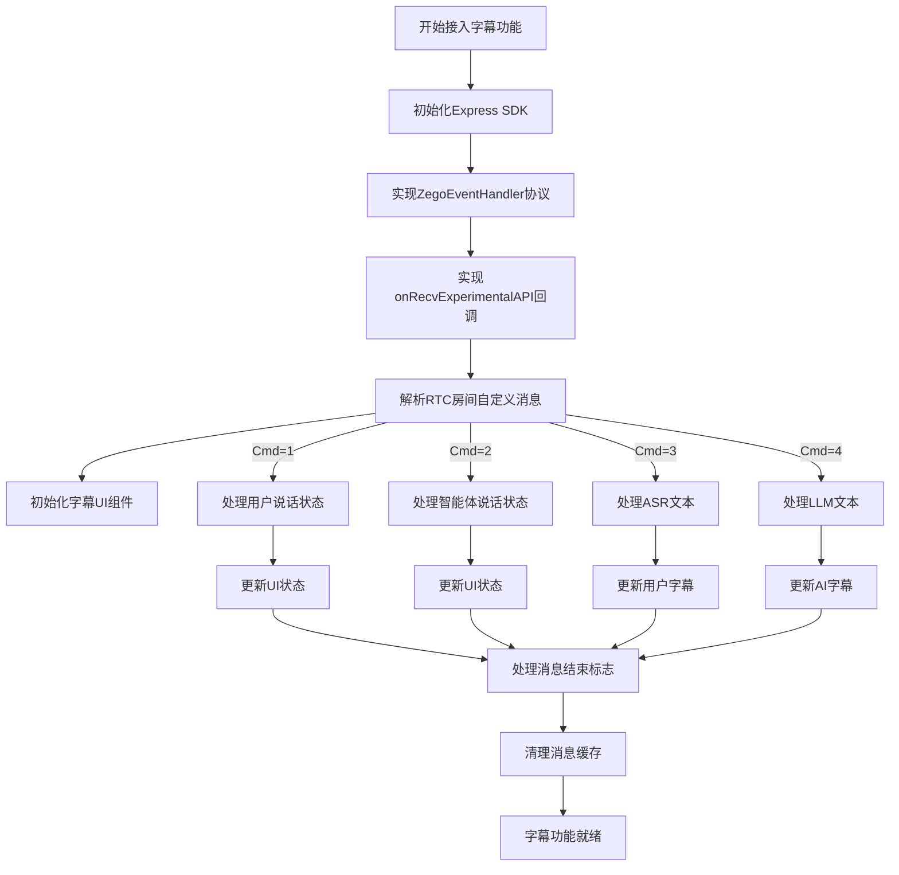
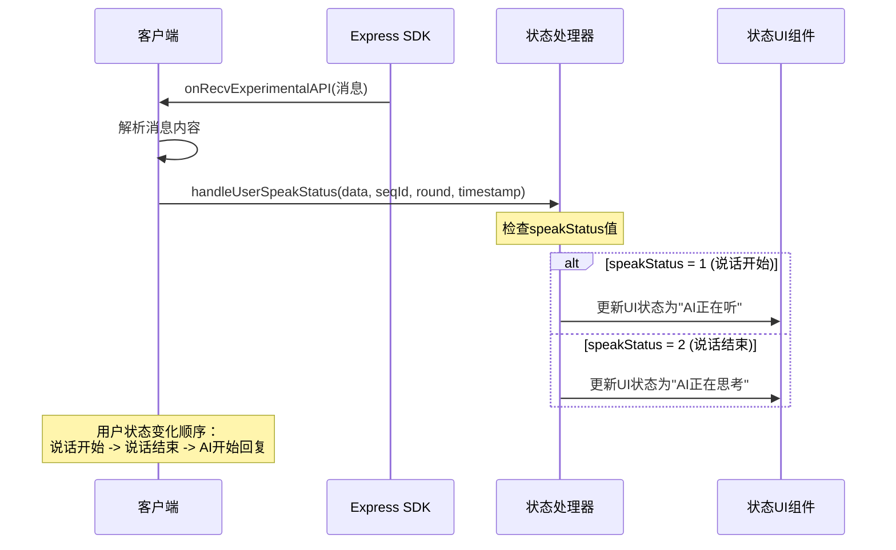
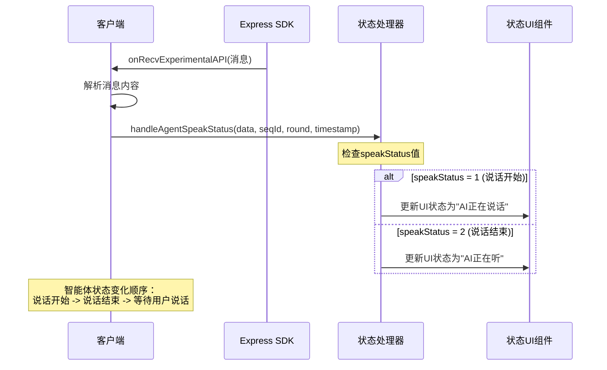
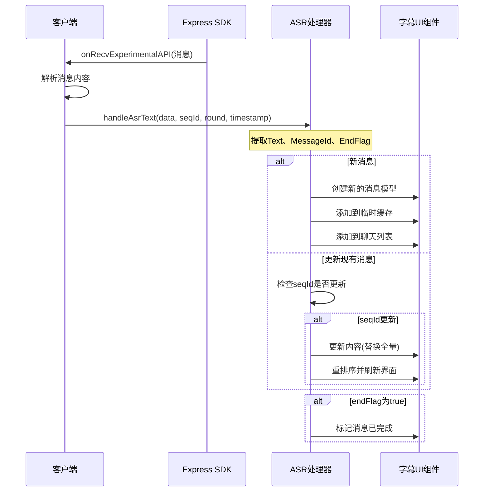
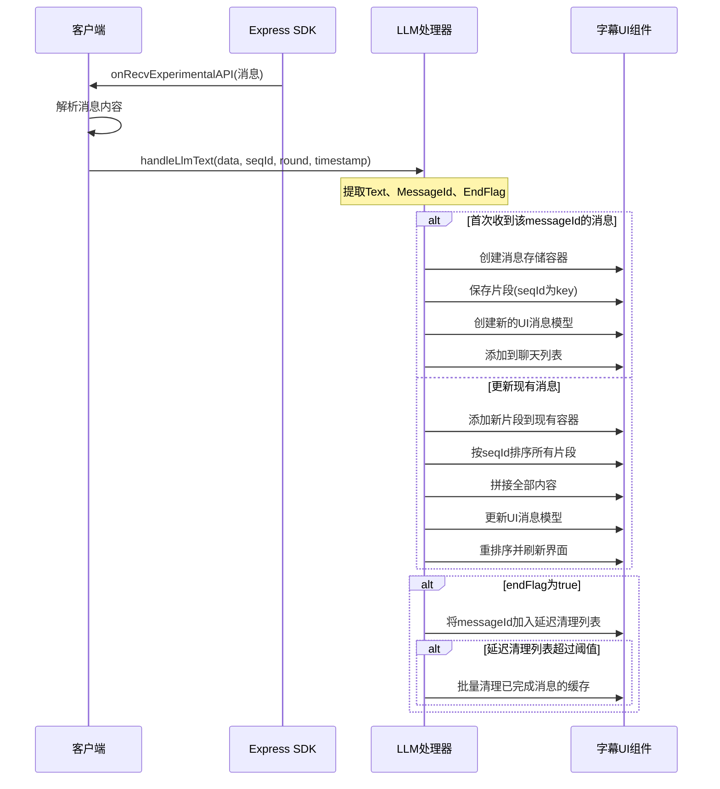

# AI语音通话实时字幕功能接入文档

## 1. 功能概述

在与AI进行语音通话的过程中，实时字幕功能可以在UI上展示以下内容：

1. **通话状态**

   - 呼叫中（服务初始化中）
   - 呼叫成功（服务初始化完成，可以开始互动）
2. **互动状态**

   - AI说话状态：正在说话，未说话
   - 用户状态：正在说话，未说话
3. **实时字幕**

   - 用户内容：流式展示用户正在说的话（ASR语音识别结果）
   - AI回应内容：流式展示AI输出的内容（大语言模型实时输出结果）

## 2. 协议说明

### 2.1 RTC房间事件消息协议

用户与Agent进行语音对话期间，服务端通过RTC房间自定义消息下发状态信息，如用户说话状态、机器人说话状态、ASR识别文本、大模型回答的文本等。客户端监听房间自定义消息，解析对应的状态事件来渲染UI。

协议基本结构：

| 参数      | 类型   | 描述                                                                              |
| --------- | ------ | --------------------------------------------------------------------------------- |
| Timestamp | int64  | 时间戳，秒级别                                                                    |
| SeqId     | int64  | 包序列号，保证有序性，不保证连续性                                                |
| Round     | int64  | 对话轮次，每次用户主动说话轮次增加                                                |
| Cmd       | int    | 1:用户说话状态 `<br>`2:智能体说话状态 `<br>`3:识别的ASR文本 `<br>`4:LLM文本 |
| Data      | Object | 具体内容，各Cmd对应不同Data                                                       |

#### 2.1.1 Cmd = 1 (用户说话状态)

| 参数        | 类型 | 描述                     |
| ----------- | ---- | ------------------------ |
| SpeakStatus | int  | 1: 说话开始, 2: 说话结束 |

#### 2.1.2 Cmd = 2 (智能体说话状态)

| 参数        | 类型 | 描述                     |
| ----------- | ---- | ------------------------ |
| SpeakStatus | int  | 1: 说话开始, 2: 说话结束 |

#### 2.1.3 Cmd = 3 (ASR用户语音文本)

| 参数      | 类型   | 描述                                                      |
| --------- | ------ | --------------------------------------------------------- |
| Text      | string | 用户语音asr文本`<br>`每次下发的是全量文本，支持文本修正 |
| MessageId | string | 消息id，每轮 asr 文本消息id 唯一                          |
| EndFlag   | bool   | 结束标识，true表示本轮 asr 文本已处理完成                 |

#### 2.1.4 Cmd = 4 (LLM大模型文本)

| 参数      | 类型   | 描述                                      |
| --------- | ------ | ----------------------------------------- |
| Text      | string | llm文本`<br>`每次下发增量文本           |
| MessageId | string | 消息id，每轮 llm 文本消息id唯一           |
| EndFlag   | bool   | 结束标识，true表示本轮 llm 文本已处理完成 |

## 3. 接入步骤

### 3.0 完整接入流程图



### 3.1 监听SDK事件

实现ZegoEventHandler协议以接收RTC房间自定义消息：

```objective-c
// 在头文件中实现ZegoEventHandler协议
@interface YourViewController () <ZegoEventHandler>
@end

// 在实现文件中
- (void)onRecvExperimentalAPI:(NSString *)content {
    if (content == nil) {
        NSLog(@"接收到的内容为空");
        return;
    }
  
    // 解析JSON内容
    NSError *error;
    NSData *jsonData = [content dataUsingEncoding:NSUTF8StringEncoding];
    NSDictionary *contentDict = [NSJSONSerialization JSONObjectWithData:jsonData 
                                                        options:NSJSONReadingMutableContainers 
                                                          error:&error];
    if (error || !contentDict) {
        NSLog(@"JSON解析失败: %@", error);
        return;
    }
  
    // 检查是否为房间消息
    NSString *method = contentDict[@"method"];
    if (![method isEqualToString:@"liveroom.room.on_recive_room_channel_message"]) {
        return;
    }
  
    // 获取消息参数
    NSDictionary *params = contentDict[@"params"];
    if (!params) {
        return;
    }
  
    NSString *msgContent = params[@"msg_content"];
    if (!msgContent) {
        return;
    }
  
    // 解析消息内容
    [self handleMessageContent:msgContent];
}

// 处理消息内容
- (void)handleMessageContent:(NSString *)messageContent {
    NSError *error;
    NSData *jsonData = [messageContent dataUsingEncoding:NSUTF8StringEncoding];
    NSDictionary *msgDict = [NSJSONSerialization JSONObjectWithData:jsonData 
                                                    options:NSJSONReadingMutableContainers 
                                                      error:&error];
    if (error || !msgDict) {
        return;
    }
  
    // 解析基本信息
    int cmd = [msgDict[@"Cmd"] intValue];
    int64_t seqId = [msgDict[@"SeqId"] longLongValue];
    int64_t round = [msgDict[@"Round"] longLongValue];
    int64_t timestamp = [msgDict[@"Timestamp"] longLongValue];
    NSDictionary *data = msgDict[@"Data"];
  
    // 根据命令类型处理消息
    switch (cmd) {
        case 1: // 用户说话状态
            [self handleUserSpeakStatus:data seqId:seqId round:round timestamp:timestamp];
            break;
        case 2: // 智能体说话状态
            [self handleAgentSpeakStatus:data seqId:seqId round:round timestamp:timestamp];
            break;
        case 3: // ASR文本
            [self handleAsrText:data seqId:seqId round:round timestamp:timestamp];
            break;
        case 4: // LLM文本
            [self handleLlmText:data seqId:seqId round:round timestamp:timestamp];
            break;
    }
}
```

注意：Express SDK的初始化部分在此处省略，假定已在应用启动过程中正确初始化。

### 3.2 消息处理核心逻辑

以下是处理不同类型消息的核心逻辑：

#### 用户说话状态处理 (Cmd=1)

```objective-c
- (void)handleUserSpeakStatus:(NSDictionary *)data seqId:(int64_t)seqId round:(int64_t)round timestamp:(int64_t)timestamp {
    int speakStatus = [data[@"SpeakStatus"] intValue];
  
    if (speakStatus == 1) { // 说话开始
        // 用户开始说话，显示"正在听"状态
    } else if (speakStatus == 2) { // 说话结束
        // 用户结束说话，显示"正在想"状态
    }
}
```

用户说话状态处理序列图：



#### 智能体说话状态处理 (Cmd=2)

```objective-c
- (void)handleAgentSpeakStatus:(NSDictionary *)data seqId:(int64_t)seqId round:(int64_t)round timestamp:(int64_t)timestamp {
    int speakStatus = [data[@"SpeakStatus"] intValue];
  
    if (speakStatus == 1) { // 说话开始
        // AI开始说话，显示"正在讲"状态
    } else if (speakStatus == 2) { // 说话结束
        // AI结束说话，恢复"正在听"状态
    }
}
```

智能体说话状态处理序列图：



#### ASR文本处理 (Cmd=3)

```objective-c
- (void)handleAsrText:(NSDictionary *)data seqId:(int64_t)seqId round:(int64_t)round timestamp:(int64_t)timestamp {
    NSString *content = data[@"Text"];
    NSString *messageId = data[@"MessageId"];
    BOOL endFlag = [data[@"EndFlag"] boolValue];
  
    if (content && content.length > 0) {
        // 处理ASR消息并更新UI
    }
}
```

ASR文本处理序列图：



#### LLM文本处理 (Cmd=4)

```objective-c
- (void)handleLlmText:(NSDictionary *)data seqId:(int64_t)seqId round:(int64_t)round timestamp:(int64_t)timestamp {
    NSString *content = data[@"Text"];
    NSString *messageId = data[@"MessageId"];
    BOOL endFlag = [data[@"EndFlag"] boolValue];
  
    if (content && content.length > 0) {
        // 处理LLM消息并更新UI
    }
}
```

LLM文本处理序列图：



## 4. 注意事项

1. **消息顺序处理**：服务器可能会发送乱序的消息，需要根据SeqId进行排序处理。
2. **流式文本处理**：

   - ASR文本每次下发的是全量文本，需要完全替换之前的内容
   - LLM文本每次下发的是增量文本，需要累加到之前的内容
3. **状态转换**：

   - 用户说话 -> AI思考 -> AI回复 -> 用户说话
   - 每个状态都需要正确处理并更新UI
4. **消息去重**：确保处理消息时检查SeqId，避免处理已经过时的消息。
5. **内存管理**：及时清理已完成的消息缓存，特别是当用户进行长时间对话时。

## 5. 常见问题

1. **问题**: 为什么有些消息没有显示？
   **解答**: 检查是否正确处理了SeqId和是否正确组装了增量消息。
2. **问题**: 为什么状态显示不正确？
   **解答**: 确保正确实现了所有状态转换的处理逻辑，并在UI上及时更新。
3. **问题**: 如何处理网络延迟导致的消息乱序？
   **解答**: 使用SeqId对消息进行排序，确保按照正确顺序处理和显示。
4. **问题**: 如何提高字幕显示的流畅度？
   **解答**: 优化UI更新逻辑，减少主线程阻塞，可以考虑使用异步处理消息和UI更新。
